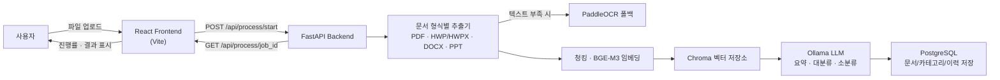

# 📄 Document Mini Project — AI 문서 OCR·요약·분류 RAG 시스템

문서(HWP/HWPX, PDF, DOCX, PPT/PPTX)를 업로드하면 **OCR로 텍스트를 추출**하고, **RAG 파이프라인으로 벡터화**한 뒤 **로컬 LLM(Ollama)** 이 문서를 **요약**하고 **대분류·소분류**까지 자동으로 처리해 주는 풀스택 프로젝트입니다.

> React 프론트엔드에서 파일을 업로드하면, FastAPI 백엔드가 형식별 추출 → OCR 폴백 → 청킹/임베딩 → Chroma 저장 → LLM 요약·분류 → PostgreSQL 저장까지 전 과정을 처리하고, 진행 상태를 실시간으로 프론트엔드에 반환합니다.

---

## 🗂 Repositories

| Repo | 설명 | 스택 |
| --- | --- | --- |
| [`frontend`](https://github.com/doc-mini-project/frontend) | 업로드 · 진행 상태 · 결과(요약/분류) 확인 UI | React 18, Vite 6, Axios |
| [`backend`](https://github.com/doc-mini-project/backend) | 문서 추출·OCR·RAG·LLM 요약/분류 API 서버 | FastAPI, PostgreSQL, Chroma, Ollama, PaddleOCR |

---

## 🖇 시스템 아키텍처



---

## ⚙️ 처리 흐름

```
문서 업로드
  → 확장자/형식 검증 (.hwp .hwpx .pdf .docx .ppt .pptx)
  → 문서별 텍스트 추출 (+ 필요 시 OCR 폴백)
  → 청킹 및 임베딩 (Sentence Transformers, BGE-M3)
  → Chroma 벡터 저장소 구성
  → Ollama 기반 요약 · 대분류 · 소분류
  → PostgreSQL 저장
  → 처리 결과를 job_id 기준으로 프론트엔드에 반환
```

---

## ✨ 주요 기능

- 클릭 또는 드래그 앤 드롭 문서 업로드, 확장자 자동 검증
- `job_id` 기반 비동기 처리 및 실시간 진행률/단계 표시
- 문서 요약 결과 확인 및 텍스트 다운로드
- 문서 대분류·소분류 자동 분류 결과 제공
- 문서 형식별 전용 추출기 + OCR 폴백으로 스캔본/이미지 기반 문서도 처리

---

## 🧱 기술 스택

**Frontend**
- React 18, Vite 6, Axios

**Backend**
- FastAPI, Uvicorn, Pydantic
- PostgreSQL, SQLAlchemy
- PaddleOCR, PyMuPDF, pdfplumber (텍스트/OCR 추출)
- LangChain, Sentence Transformers, Chroma (RAG 파이프라인)
- Ollama (로컬 LLM 요약·분류, 기본 모델 `qwen3:8b`)
- 임베딩 모델: `BAAI/bge-m3`

---

## 🚀 빠른 시작

### 1. Backend

```bash
git clone https://github.com/doc-mini-project/backend.git
cd backend

python -m venv .venv
source .venv/bin/activate
pip install -r requirements.txt

cp .env.example .env
# .env에서 DATABASE_URL, OLLAMA_MODEL 등을 환경에 맞게 수정

ollama pull qwen3:8b
ollama serve

uvicorn main:app --reload --port 8000
```

- API 문서: http://localhost:8000/docs
- 상태 확인: http://localhost:8000/health

> PostgreSQL과 Ollama가 먼저 실행되어 있어야 하며, HWP 변환은 환경에 따라 LibreOffice 등 별도 변환 도구가 필요할 수 있습니다.

### 2. Frontend

```bash
git clone https://github.com/doc-mini-project/frontend.git
cd frontend

npm install
cp .env.example .env
# VITE_API_BASE_URL이 백엔드 주소와 다르면 수정

npm run dev
```

- 개발 서버: http://localhost:5173

---

## 🔌 API

| Method | Endpoint | 설명 |
| --- | --- | --- |
| `GET` | `/health` | 서버 상태 확인 |
| `POST` | `/api/process/start` | 문서 업로드 및 처리 시작 (`job_id` 반환) |
| `GET` | `/api/process/{job_id}` | 진행 상태(progress/stage/message) 및 처리 결과 조회 |

---

## 📁 프로젝트 구조 요약

**backend**
```
main.py                 # FastAPI 진입점, 작업 상태 관리
document_pipeline.py     # 문서 형식별 추출 오케스트레이션
rag_pipeline.py          # 청킹·임베딩·Chroma 저장
llm_chain.py              # Ollama 요약·분류
database.py / models.py   # PostgreSQL 연결 및 SQLAlchemy 모델
extractors/               # PDF · HWP/HWPX · DOCX · PPT 추출기
utils/                     # 공통 유틸리티
```

**frontend**
```
src/App.jsx      # 업로드 · 진행 상태 · 결과 화면
src/api.js       # 백엔드 API 호출
src/main.jsx     # React 진입점
src/styles.css   # 화면 스타일
```

---

## ⚠️ 참고 사항

- `.env` 파일은 저장소에 커밋하지 않습니다.
- 업로드 원본, OCR 결과, Chroma 데이터는 실행 중 생성되며 Git에서 제외됩니다.
- 현재 작업 상태는 메모리에 저장되므로 백엔드 서버 재시작 시 초기화됩니다.